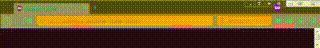

# Theme animation
## Introduction
Experimental WebExtensions to show how to animate a theme in Firefox 59 and more

 
## What it does
2 animations

* Effect 1

Change the color in the loop

* Effect 2

Employs an animated SVG image as the headerURL image in a theme.

## What it shows

The extension does:

- Change the color "accentcolor" using the RGB palette (0 to 255)

- Displays a square with a rotation of it

## Crédit
(c) Christophe Villeneuve aka Hello / Sector One

Réalisé en 2017

